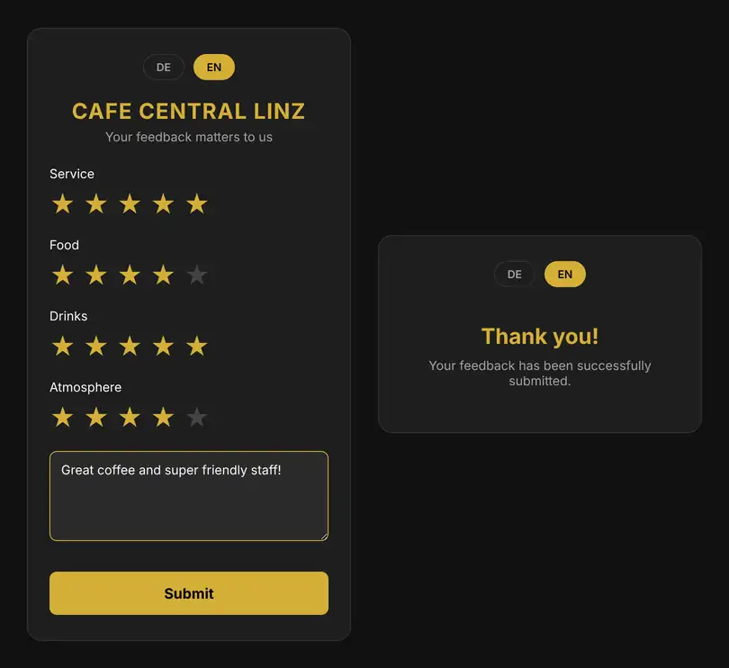
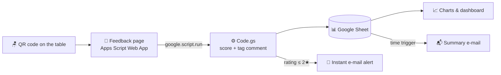
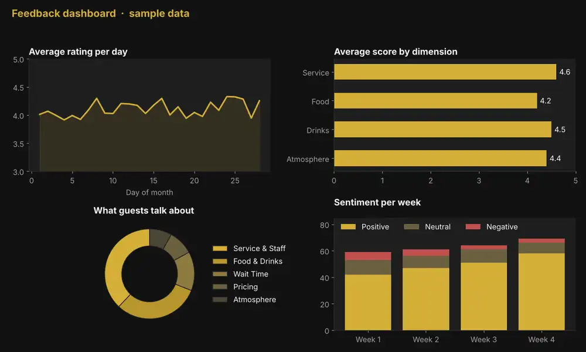

# ☕ QR Restaurant Feedback

**Scan → Rate → See it on your dashboard in seconds.**
A zero-cost guest feedback system for cafés and restaurants, built entirely on Google Apps Script, Google Sheets and Gmail. No servers, no subscriptions, no app to install.

Guests scan a QR code on the table, rate their visit on their phone in about 20 seconds, and the review shows up immediately in a Google Sheet that drives live charts. If someone is unhappy, the owner gets an e-mail **before the guest has even left the building**.

> Originally built for **Cafe Central Linz** (Austria) — bilingual German / English out of the box.

<p align="center">
  
</p>

---

## Why this exists

Most unhappy guests don't complain to the waiter. They just leave a 1-star review on Google Maps a few hours later.
This project gives them a quick, private place to say what went wrong while they're still at the table, and gives the owner a chance to fix it on the spot.

| Problem | What this project does |
|---|---|
| Paper comment cards end up in a drawer | Every review becomes a row in Google Sheets in real time |
| Paid feedback tools cost €30–100 / month | Runs free on a regular Google account |
| Bad experiences are discovered too late | Instant e-mail alert for any rating ≤ 2 ★ |
| Hundreds of comments, no overview | Each comment is tagged by topic and sentiment, so you can chart it |
| International guests | One-tap DE / EN language switch |

---

## ✨ Features

- **📱 Mobile-first feedback page**: dark, elegant UI with gold accents and tap-to-rate stars, built for a phone in one hand and a coffee in the other.
- **⭐ Four rating dimensions**: Service, Food, Drinks and Atmosphere, plus an optional comment. The overall score is calculated automatically.
- **🌍 Bilingual**: German and English with an instant language toggle. The chosen language is stored with each review.
- **📊 Straight into Google Sheets**: every submission is appended as a new row, so your charts and pivot tables update on their own.
- **🏷️ Automatic topic & sentiment tagging**: comments are classified into *Service & Staff*, *Food & Drinks*, *Wait Time*, *Pricing* or *Atmosphere & Cleanliness* and marked Positive / Neutral / Negative. It recognises keywords in German, English and Slovak and runs offline, with no external API, no cost and no rate limits.
- **🚨 Low-rating alerts**: an e-mail goes to the owner the moment a guest leaves 2 stars or fewer.
- **📬 Summary report**: a scheduled e-mail with total reviews, average score and the share of positive feedback.
- **📸 Photo support (backend-ready)**: the server can save guest photos to a Google Drive folder and link them in the sheet.

---

## 🧭 How it works



Each review is stored as one row:

| Date | Overall | Service | Food | Drinks | Atmosphere | Comment | Photo | Category | Sentiment | Lang |
|---|---|---|---|---|---|---|---|---|---|---|
| 01.10.2026 18:42:10 | 4.5 | 5 | 4 | 5 | 4 | Super Kaffee, sehr freundlich! | - | Service & Staff | Positive | DE |

---

## 🚀 Setup (about 10 minutes)

1. **Create the sheet**: make a new Google Sheet and add the header row above. Copy its ID from the URL:
   `https://docs.google.com/spreadsheets/d/`**`THIS_PART`**`/edit`
2. **Create the script**: open [script.google.com](https://script.google.com), start a new project and add:
   - `Code.gs` → paste [`src/Code.gs`](src/Code.gs)
   - an HTML file called **`Index`** → paste [`src/Index.html`](src/Index.html)
   - *(optional)* turn on *Project Settings → Show "appsscript.json"* and paste [`src/appsscript.json`](src/appsscript.json)
3. **Configure**: at the top of `Code.gs` set:
   ```js
   const SHEET_ID = 'your-sheet-id';
   const NOTIFICATION_EMAIL = 'owner@your-restaurant.com';
   const VENUE_NAME = 'Your Restaurant';
   ```
   Change the name in the `<h1>` of `Index.html` as well.
4. **Deploy**: go to *Deploy → New deployment → Web app*, choose
   *Execute as: **Me*** and *Who has access: **Anyone***, then authorise the permissions.
5. **Make the QR code**: copy the Web App URL and turn it into a QR code with any free generator. Print it on table cards, menus or receipts.
6. **(Optional) Summary e-mails**: go to *Triggers → Add trigger → `sendWeeklyReport` → Time-driven* and pick daily or weekly.

### 📈 Building the dashboard

All charts are plain Google Sheets charts on top of the review data. Some useful ones:

- **Average rating over time**: line chart of *Overall* by date
- **Category scores**: column chart comparing the average Service / Food / Drinks / Atmosphere scores
- **What people talk about**: pie chart of the *Category* column
- **Mood meter**: stacked bar of *Sentiment* per week
- **Guest origin**: DE vs EN share from the *Lang* column

Because new reviews are just new rows, every chart stays up to date without any extra work.

<p align="center">
  
  <br><sub>Example dashboard with illustrative sample data, no real guest reviews.</sub>
</p>

---

## 🛠️ Tech stack

- **Google Apps Script** (V8 runtime): backend and web app hosting
- **HTML / CSS / vanilla JS**: frontend with no frameworks and no build step
- **Google Sheets**: database and dashboard
- **MailApp / DriveApp**: alerts, reports and photo storage

## 📁 Project structure

```
qr-restaurant-feedback/
├── src/
│   ├── Code.gs          # Backend: scoring, tagging, sheet writes, e-mails
│   ├── Index.html       # Mobile feedback page (DE/EN)
│   └── appsscript.json  # Apps Script manifest (web app settings)
├── docs/                # Screenshots
└── README.md
```

## 🗺️ Ideas for the future

- Photo upload button in the form (the backend already supports it)
- Per-table QR codes (`?table=12`) to find problem areas
- Optional LLM-based sentiment analysis for more nuanced tagging
- A "Leave us a Google review" prompt for 5-star guests

## 🤝 Contributing

Pull requests and ideas are welcome. Feel free to fork it and adapt it for your own café, bar, hotel or barbershop.

## 📄 License

[MIT](LICENSE): free to use, modify and share.
